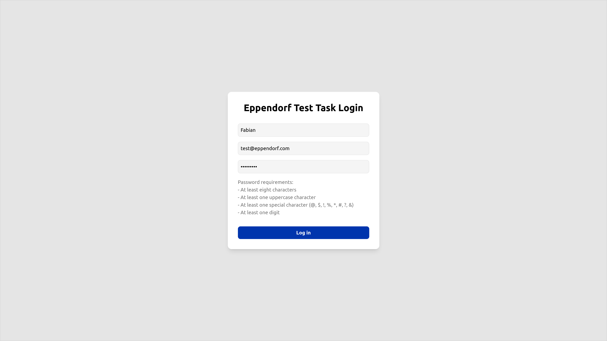
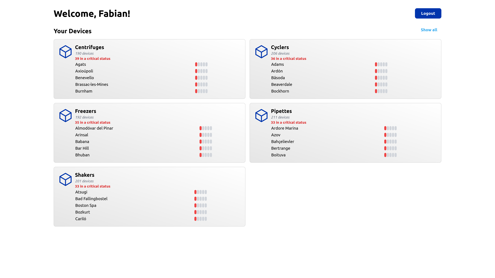
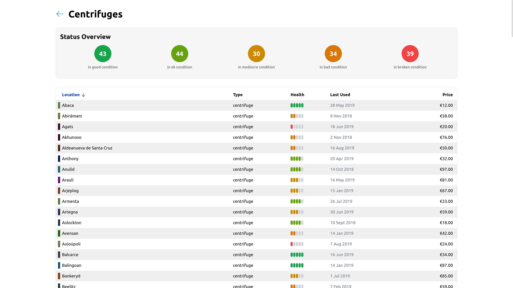
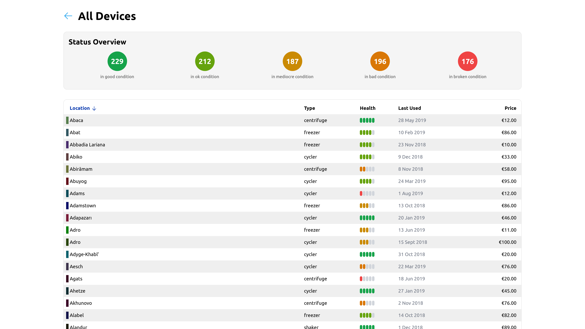
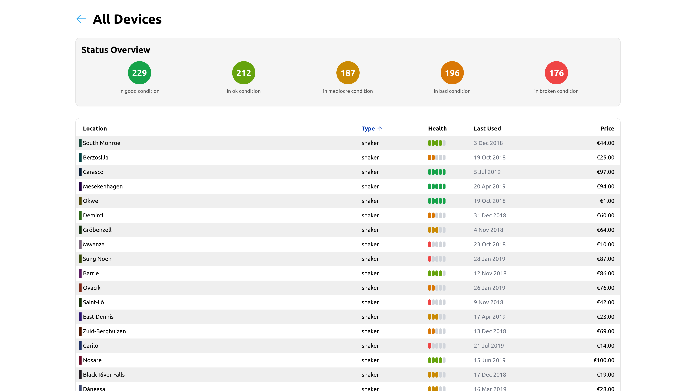
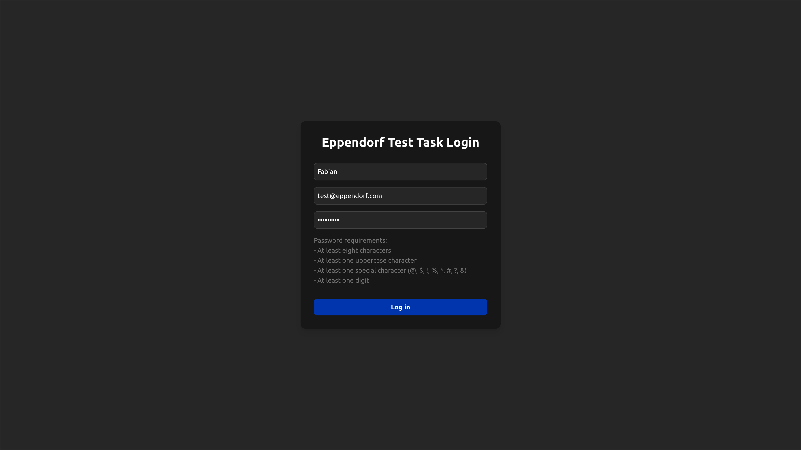
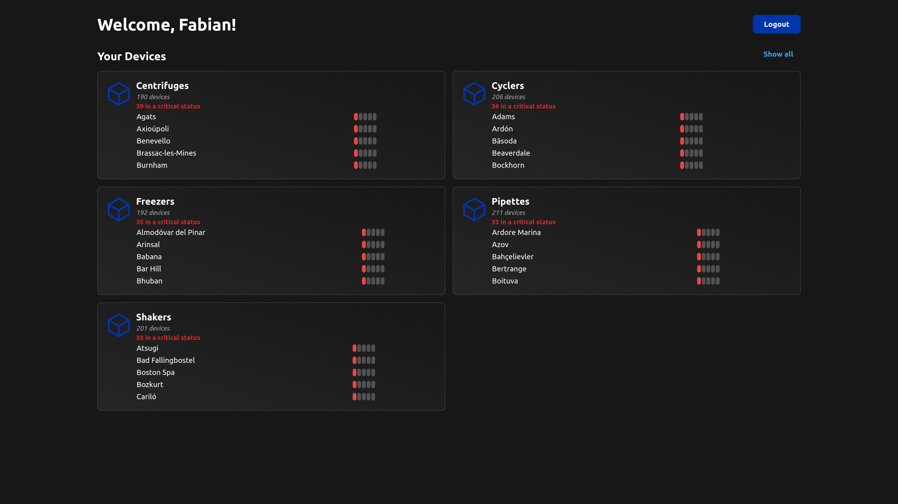
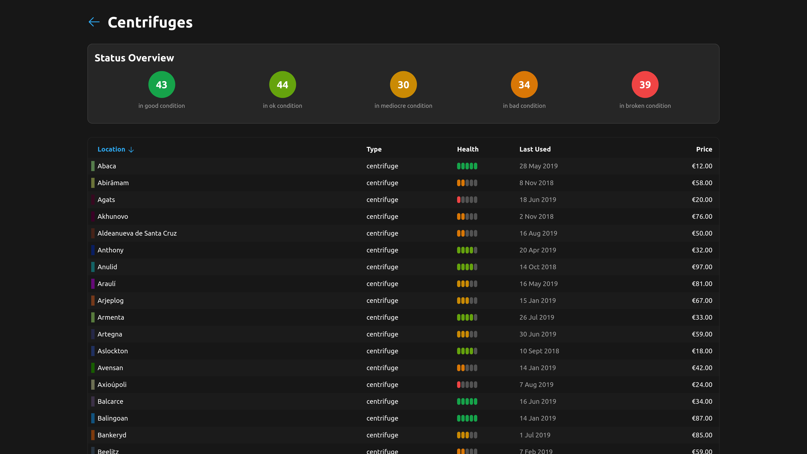
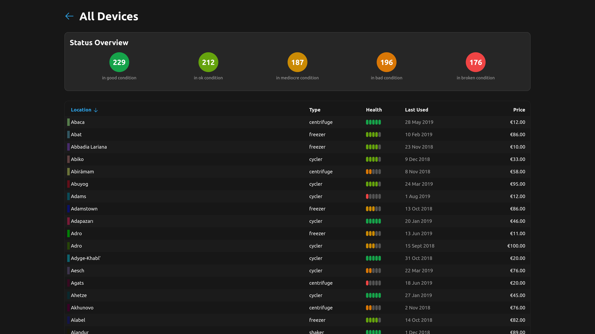
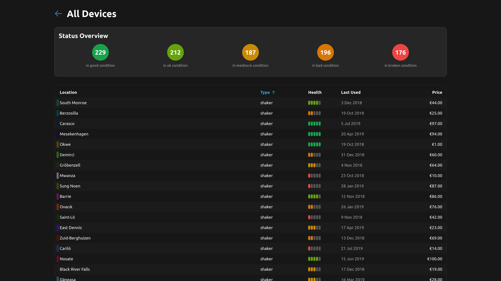

# Eppendorf Test Task

This repository contains my solution to the frontend challenge provided by [Eppendorf SE](https://www.eppendorf.com). The full task description can be found in `/TASK.md`.

## Screenshots

<details>
    <summary>Show Light Mode Screenshots</summary>

    





</details>


<details>
    <summary>Show Dark Mode Screenshots</summary>






</details>


## How to use this
### Build
Simply clone this repository and install the dependencies.
```bash
git clone https://github.com/fabianthdev/eppendorf-test-task
cd eppendorf-test-task && npm install
```

Then, the development server can be started with:
```bash
npm run dev
```

### Login Credentials
Any valid email address and password combination will be accepted. However, since this project makes mocked calls to a backend, only the following credentials allow access to the dashboard:
- Name: Any name that is longer than two characters will suffice.
- E-Mail: `test@eppendorf.com`
- Password: `Passw0rd!`


## Technologies Used
Since I'm most familiar with Vue when it comes to frontend development, that was my framework of choice. I know that eppendorf uses React instead, however for this test task I didn't want to spend most of my time on learning React and deliver a mediocre result in the end.

Technologies:
- Vue 3
- Vite
- TailwindCSS
- Language: TypeScript
- GitHub Actions for production build on push on main branch, with exported artifact


## UI Design Considerations
Since I couldn't find any high-resolution screenshots of a typical eppendorf UI, I mainly applied the same design language I use in my other projects here. However, I did use the blue color of the eppendorf logo as a primary color and the turquoise color from the eppendorf website as the accent color.
The project fully supports the device's preferred color scheme.


## Working Time
All in all, this project took me almost eight hours from start to finish. However, the core parts of the task were done in abort one to two hours. The rest of the time was spent on mocking the login system and network requests, as well as the main view and the overall design of the interface.